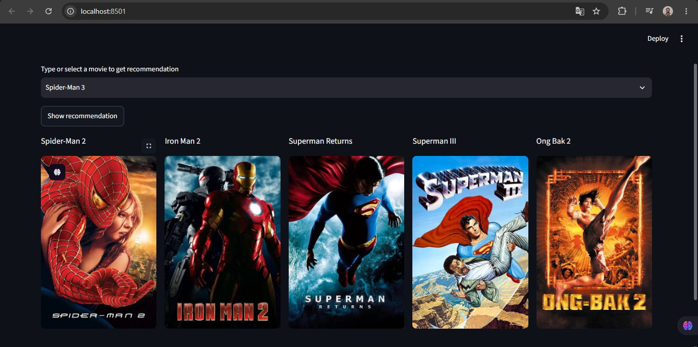

# Movie Recommendation System

This project is split into two parts:

- `backend/` contains the FastAPI API and all Python code
- `frontend/` contains the React app with TanStack Query

The frontend reads the API base URL from an environment variable so you can keep
`localhost` during development and switch to a production URL later without
changing the app code.

## Screenshot



## Project Structure

```text
movie_recommendation/
|-- backend/
|   |-- app/
|   |   |-- __init__.py
|   |   |-- config.py
|   |   |-- main.py
|   |   |-- recommender.py
|   |   |-- schemas.py
|   |   `-- tmdb.py
|   |-- data/
|   |   |-- movies.json
|   |   `-- recommendations.json
|   |-- notebooks/
|   |   |-- artificats/
|   |   |   |-- movie_list.pkl
|   |   |   `-- similarity.pkl
|   |   `-- tmdb.ipynb
|   |-- scripts/
|   |   `-- build_runtime_data.py
|   |-- .env.example
|   `-- requirements.txt
|-- frontend/
|   |-- src/
|   |   |-- App.jsx
|   |   |-- api.js
|   |   |-- main.jsx
|   |   `-- styles.css
|   |-- .env.example
|   |-- index.html
|   |-- package.json
|   `-- vite.config.js
`-- README.md
```

## Backend

- FastAPI API for the movie catalogue and recommendations
- TMDB poster lookup stays in Python
- Cached loading for the pickled artifacts
- CORS configured for the React dev server

### Backend env

- `TMDB_API_KEY`
- `TMDB_API_URL`
- `TMDB_IMAGE_BASE_URL`
- `BACKEND_CORS_ORIGINS`

### Backend run

From `backend/`:

```bash
pip install -r requirements-dev.txt
python scripts/build_runtime_data.py
uvicorn app.main:app --reload
```

`requirements.txt` is now production-only so Vercel installs a lighter backend bundle.
Use `requirements-dev.txt` locally when you need the notebook, dev tooling, or to regenerate the JSON runtime data.

## Frontend

- React UI
- TanStack Query for data fetching
- API base URL driven by `VITE_API_URL`

### Frontend env

- `VITE_API_URL=http://localhost:8000`

### Frontend run

From `frontend/`:

```bash
npm install
npm run dev
```

## Notes

- Streamlit has been removed.
- All Python code and the notebook now live under `backend/`.
- I did not install any dependencies; only the project files were reorganized and coded.
